**SENG 637 - Dependability and Reliability of Software Systems**

**Lab. Report #3 – Code Coverage, Adequacy Criteria and Test Case Correlation**

| Group #18:     |     |
| -------------- | --- |
| Student Names: | Taran Bains    |
|                | Balkarn Gill    |
|                | Hannah D'Souza    |
|                | Satchy Karalasingham     |
|		 | Chioma Ukaegbu 	|


(Note that some labs require individual reports while others require one report
for each group. Please see each lab document for details.)

# 1 Introduction

Text…

# 2 Manual data-flow coverage calculations for X and Y methods

### Range Class, Intersect Method (Range.Intersect)

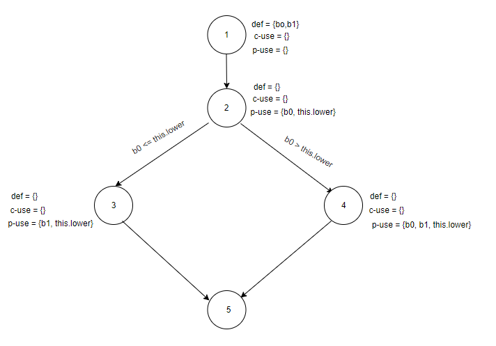

#### Def-Use sets per statement
| | |
|:--:|:--:|
| defs: | def(1) = {b0, b1} |
| uses: | use(2) = {b0, this.lower} |
| | use(3) = {b1, this.lower} |
| | use(4) = {b0, b1, this.lower} |
| du-pairs: | for b0: (1, 2), (1, 4) |
| | for b1: (1, 3), (1, 4) |

#### DU-Pair per variable
| Variable | Def at node (n) | DCU (v, n) | DPU (v, n) |
|:--:|:--:|:--:|:--:|
| b0 | 1 | {} | {(2, 3), (2, 4)} |
| b1 | 1 | {} | {} |

Total
CU = 0
PU = 2

#### DU-Pair Coverage
| | |
|:--:|:--:|
| Test Case | DU-pairs covered |
| intersectsWithBLBAndLB | dpu {(2, 3)} |
| intersectsWithBLBAndALB | dpu {(2, 3)} |
| intersectsWithBLBAndAUB | dpu {(2, 3)} |
| intersectsWithLBAndALB | dpu {(2, 3)} |
| intersectsWithLBAndUB | dpu {(2, 3)} |
| intersectsWithNormalAndNormal | dpu {(2, 4)} |
| intersectsWithBUBAndUB | dpu {(2, 4)} |
| intersectsWithBUBAndAUB | dpu {(2, 4)} |
| intersectsWithUBAndAUB | dpu {(2, 4)} |
| intersectsWithInputAUBAndMAX | dpu {(2, 4)} |
| intersectsWithInputBLBAndMIN | dpu {(2, 3)} |
| intersectsWithInputNaNAnd1 | dpu {(2, 4)} |

### DataUtilities Class, calculateColumnTotal Method

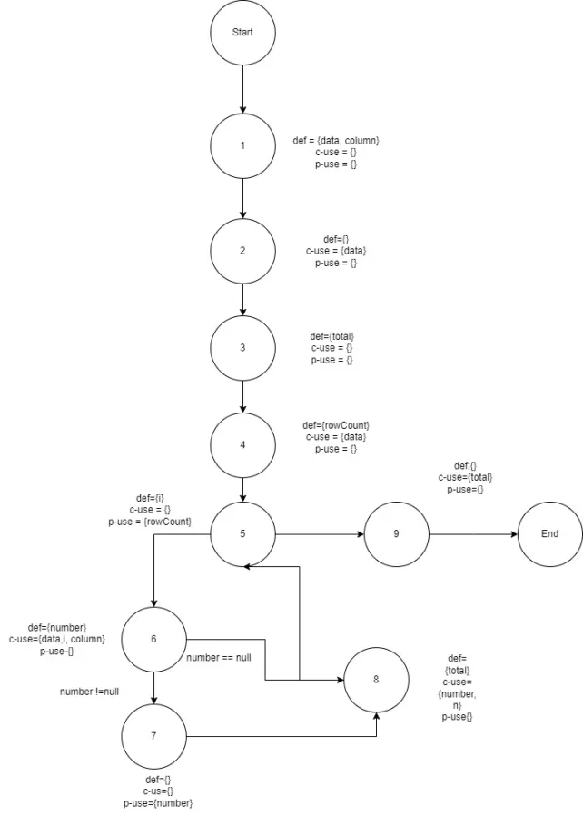  


defs	Def(1)={data,column}
	Def{3}={total}
	Def{4}={rowCount}
	Def{5}={i}
	Def{6}={number}
	Def{8}={total}
uses	Use{2}={data}
	Use{4}={data}
	Use{6}={data,I,column}

defs	Def(1)={data,column}
	Def{3}={total}
	Def{4}={rowCount}
	Def{5}={i}
	Def{6}={number}
	Def{8}={total}
uses	Use{2}={data}
	Use{4}={data}
	Use{6}={data,I,column}
	Use{8}={number,n}
	Use{9}={total}
Du-pairs	For data: (1,2), (1,4), (1,6),
	For column: (1,6)
	For total: (3, 9), (8,9)
	For rowCount: (4,5)
	For i: (5,6)
	For number: (6,7), (6,8)
	

Test Case	Du Pairs Covered
testCalculateColumnTotalWithColumnZero		(1,2), (1,4), (1,6) and (3,9) and (8,9)
testCalculateColumnTotalWithMissingValue		(1,2), (1,4), (1,6),(3,9),(8,9),(6,7) and(6,8)
testCalculateColumnTotalBasic		(1,2), (1,4), (1,6),(3,9),(8,9),(6,7) and(6,8)
testCalculateColumnTotalLastColumn	(1,2), (1,4), (1,6) and (3,9) and (8,9)
testCalculateColumnTotalOneRow	(1,2), (1,4), (1,6) and (3,9) and (8,9)
testCalculateColumnTotalOneColumn		(1,2), (1,4), (1,6) and (3,9) and (8,9)

Variable	Defined at Node (n)	DCU(v,n)	DPU(v,n)
Data	1	{1,2,4,6)	{}
Column	1	{6}	{}
Total	3	{9}	{}
rowCount	4	{}	{5}
i	5	{6}	{}
number	6	{8}	{7}


# 3 A detailed description of the testing strategy for the new unit test

The testing strategy used this time since it is a white-box testing exercise was to look at the source code and carry out a statement coverage

For Range.combineIgnoringNaN the test cases are shown below

```
    @Test
    public void testCombineIgnoringNaN_bothRangesNull() {
        Range result = Range.combineIgnoringNaN(null, null);
        assertNull(result);
    }

    @Test
    public void testCombineIgnoringNaN_range1Null() {
        Range range2 = new Range(1.0, 5.0);
        Range result = Range.combineIgnoringNaN(null, range2);
        assertEquals(range2, result);
    }

    @Test
    public void testCombineIgnoringNaN_range2Null() {
        Range range1 = new Range(1.0, 5.0);
        Range result = Range.combineIgnoringNaN(range1, null);
        assertEquals(range1, result);
    }

    @Test
    public void testCombineIgnoringNaN_bothRangesNotNull() {
        Range range1 = new Range(1.0, 5.0);
        Range range2 = new Range(3.0, 7.0);
        Range result = Range.combineIgnoringNaN(range1, range2);
        assertEquals(new Range(1.0, 7.0), result);
    }

    @Test
    public void testCombineIgnoringNaN_range1NaN() {
        Range range1 = new Range(Double.NaN, 5.0);
        Range range2 = new Range(3.0, 7.0);
        Range result = Range.combineIgnoringNaN(range1, range2);
        assertEquals(range2, result);
    }

    @Test
    public void testCombineIgnoringNaN_range2NaN() {
        Range range1 = new Range(1.0, 5.0);
        Range range2 = new Range(Double.NaN, 7.0);
        Range result = Range.combineIgnoringNaN(range1, range2);
        assertEquals(range1, result);
    }

    @Test
    public void testCombineIgnoringNaN_bothRangesNaN() {
        Range range1 = new Range(Double.NaN, 5.0);
        Range range2 = new Range(Double.NaN, 7.0);
        Range result = Range.combineIgnoringNaN(range1, range2);
        assertNull(result);
    }
    
    @Test
    public void testCombineIgnoringNaN_bothRangesNa() {
        Range range1 = new Range(Double.NaN, Double.NaN);
        Range range2 = new Range(Double.NaN, Double.NaN);
        Range result = Range.combineIgnoringNaN(range1, range2);
        assertNull(result);
    }
    
    @Test
    public void testCombineIgnoringNaN_Range1Null() {
        Range range1 = null;
        Range range2 = new Range(Double.NaN, Double.NaN);
        Range result = Range.combineIgnoringNaN(range1, range2);
        assertNull(result);
    }
    
    @Test
    public void testCombineIgnoringNaN_Range2Null() {
        Range range1 = new Range(Double.NaN, Double.NaN);
        Range range2 = null;
        Range result = Range.combineIgnoringNaN(range1, range2);
        assertNull(result);
    }
```


# 4 A high level description of five selected test cases you have designed using coverage information, and how they have increased code coverage

### Range Class
This improved the coverage a lot for the Range class.

Before new test cases

| | Coverage Before new tests |
|:--:|:--:|
| Instruction | 0.0 % |
| Branch | 0.0 % | 
| Method | 0.0 % | 

The tests had 0.0% coverage because it wasn't part of the method considered in assignment 2

After new test cases

| | Coverage Before new tests |
|:--:|:--:|
| Instruction | 100.0 % |
| Branch | 100.0 % | 
| Method | 100.0 % | 


### Data Utilities Class

Our 2 null input tests show 0% coverage on Instruction and Method coverage, digging into this it appears that because we expect the code to output an error from this, EclEmma considers these lines to have no coverage because null is not meant be input into the method. The test is checking that an IllegalArgumentException is thrown, so an error is exactly what we're looking for in these two cases. There may be a better way to implement this test so that EclEmma does not flag this test as having zero coverage, but we instead decided to focus on our code which was not running as expected.
 
Tests: testCreateArray2dNullInput() & testNullInput()
We have full branch and method coverage in DataUtilities across all other methods, but our Instruction coverage in 2 of the methods are low:

Coverage Requirement: 90%
testCreateNumberArrayWithSizeOne() - 66.7%
testCalculateRowTotalWithRowZero() - 45.5%

We first investigated our testCreateNumberArrayWithSizeOne() method. We appear to have an error related to our second Assert statement, and upon investigating further, we found this is likely related to the data types being used.

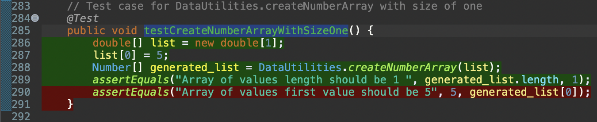  

The value 5 here is an integer literal, but the elements in the generated_list array are of type Number. While Java allows auto-unboxing of primitive types, it is good practice to explicitly cast the Number object to its primitive equivalent before comparison to ensure compatibility:

  

This ensures that we're comparing the same types. If generated_list[0] is a Double, for example, the comparison will still be valid because intValue() will extract the integer part of the Double value.
After implementing this small change of adding .intValue() to our 2nd assertion, we rerun the coverage check and got 100% coverage for the testCreateNumberArrayWithSizeOne() method

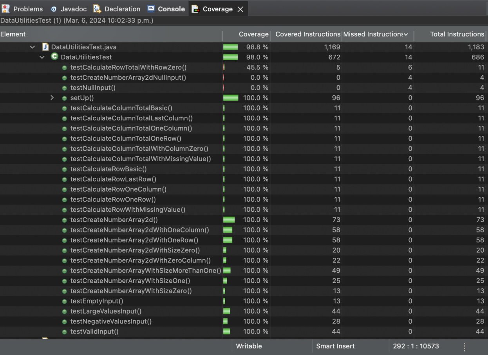  

Next we investigated our testCalculateRowTotalWithRowZero() method:

  

In this case, EclEmma helped us discover an error we made in assignment 2 which we had initially missed. The method calculates the total sum of the first sum, with the input data being a 2x3 matrix with the following values: [[0 1, 2], [10, 20, 30]]. As we can see, the sum of the values in the first row of this matrix (0, 1, 2) should be equal to 3 rather than 0 in the current code.

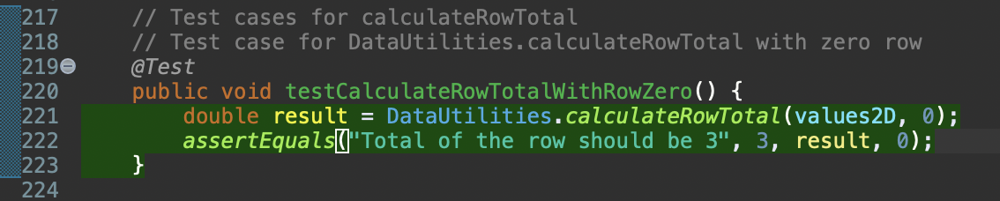  


After making this change we reran our coverage check and had 100% coverage for this test case as well:

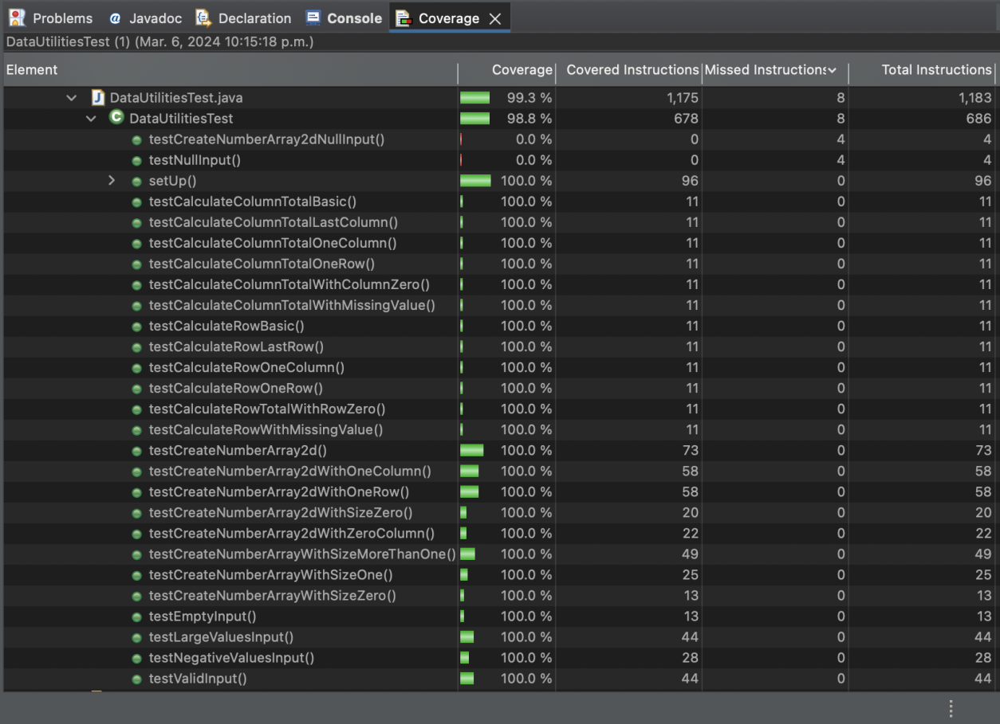  

Our new Instruction coverage for these methods are:
Coverage Requirement: 90%
testCreateNumberArrayWithSizeOne() - 100%
testCalculateRowTotalWithRowZero() - 100%


# 5 A detailed report of the coverage achieved of each class and method (a screen shot from the code cover results in green and red color would suffice)

### RANGE 

- Instruction 
  

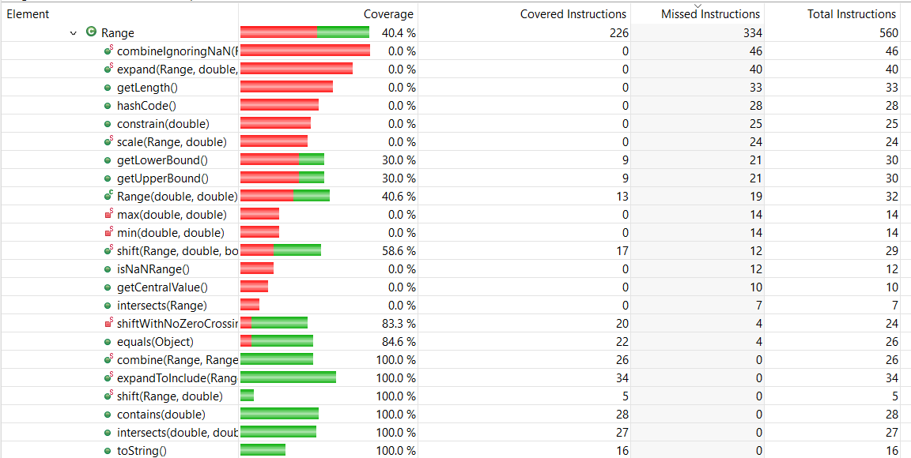  

- Branch 

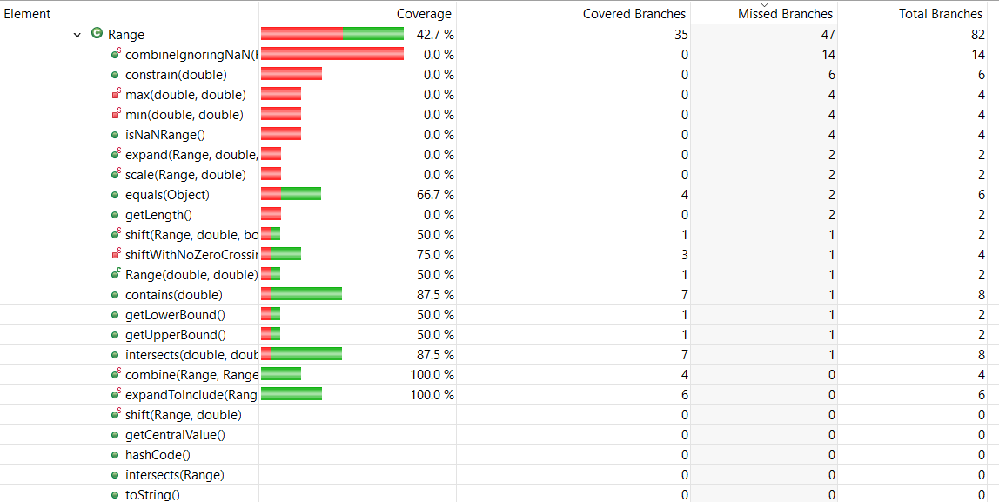 

- Method

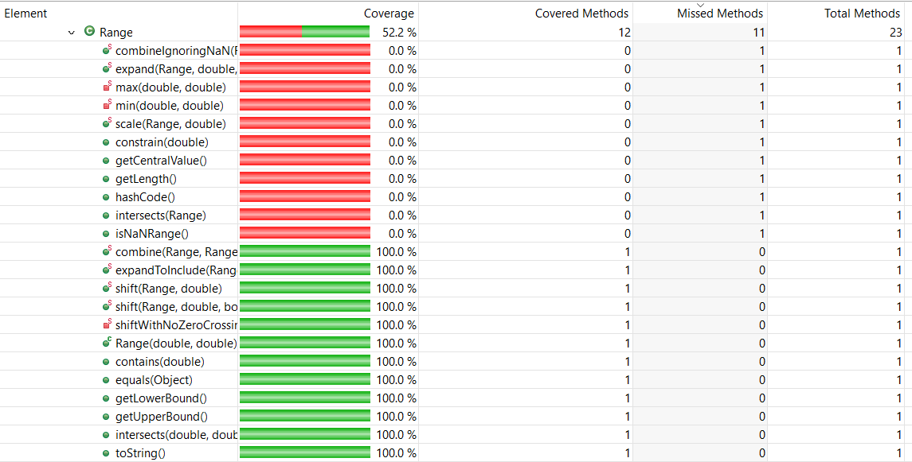 

## Screenshot of code coverage after new test

### RANGE 

- Instruction 
  
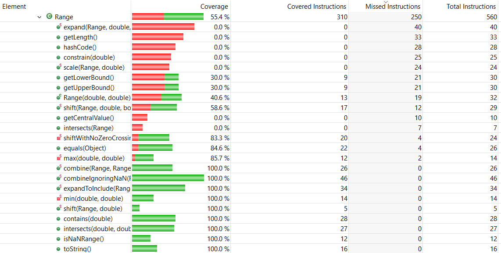  

- Branch 

 

- Method

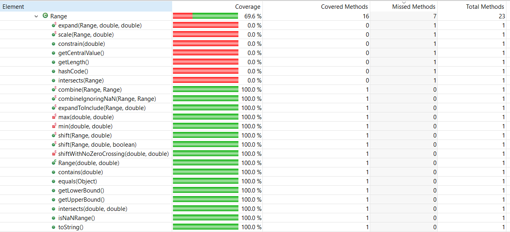 

### Data Utilities

- Instruction 
  
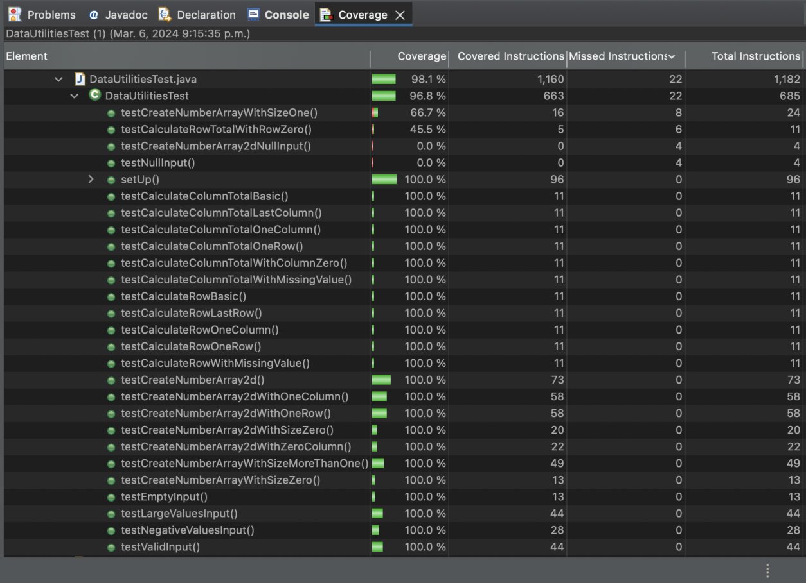  

- Branch 

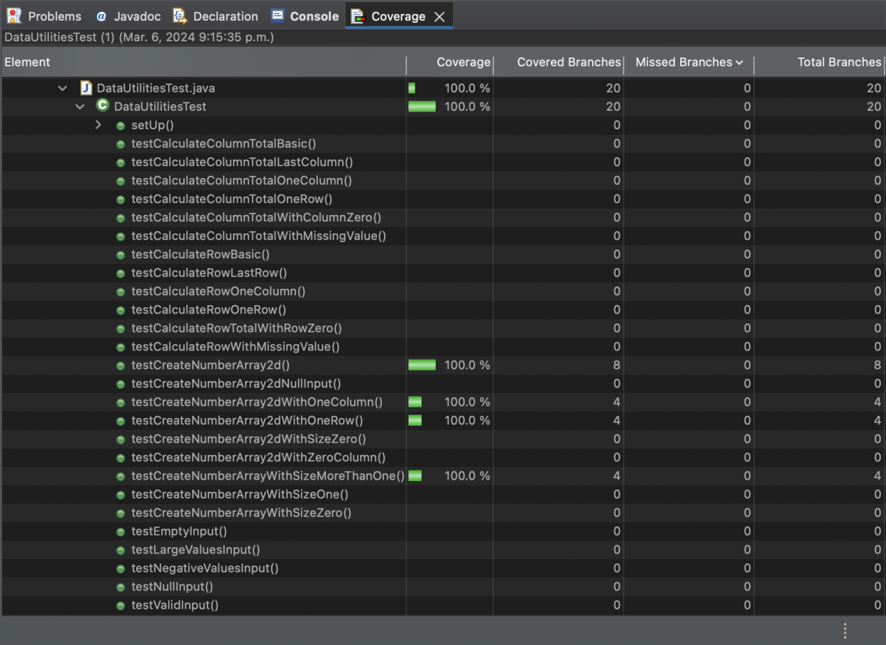 

- Method

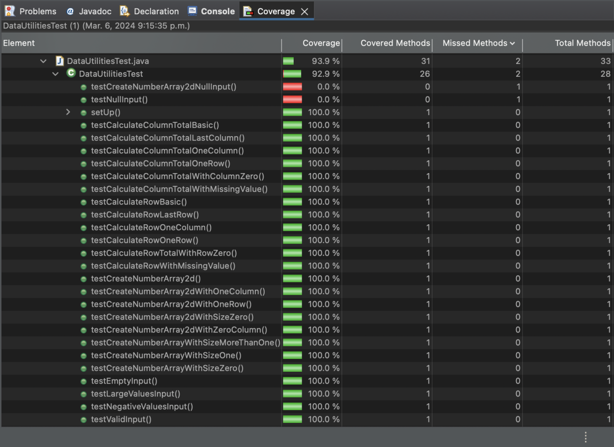 


# 6 Pros and Cons of coverage tools used and Metrics you report

Eclemma:

PROS 
- Free to use
- Easy to install and get started with in Eclipse
- EclEmma provides insights into the code coverage of your tests, indicating which parts of your code are exercised by your test suite
- The tool offers a visual representation of code coverage within the Eclipse IDE, making it easy for developers to identify uncovered or less-covered code.
- EclEmma supports various coverage metrics such as line coverage, branch coverage, and method coverage, providing a comprehensive view of your test coverage.
- EclEmma generates detailed reports, allowing developers to drill down into specific classes, methods, and lines of code to understand coverage metrics.

CONS 
- EclEmma is specific to Java programming language, so if you are working with other languages, you'll need to use different tools for code coverage analysis.
- While it integrates well with Eclipse, if you are not using Eclipse or have a different IDE, you may need to use a different code coverage tool that is compatible with your development environment.


# 7 A comparison on the advantages and disadvantages of requirements-based test generation and coverage-based test generation.

Text…

# 8 A discussion on how the team work/effort was divided and managed

Text…

# 9 Any difficulties encountered, challenges overcome, and lessons learned from performing the lab

Text…

# 10 Comments/feedback on the lab itself

Text…
