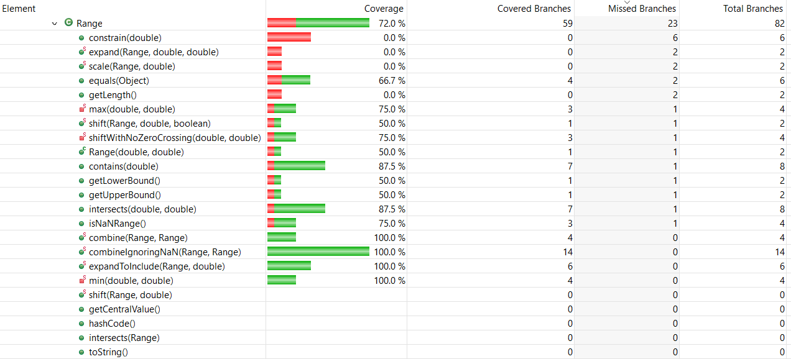

**SENG 637 - Dependability and Reliability of Software Systems**

**Lab. Report #3 – Code Coverage, Adequacy Criteria and Test Case Correlation**

| Group #18:     |     |
| -------------- | --- |
| Student Names: | Taran Bains    |
|                | Balkarn Gill    |
|                | Hannah D'Souza    |
|                | Satchy Karalasingham     |
|		 | Chioma Ukaegbu 	|


(Note that some labs require individual reports while others require one report
for each group. Please see each lab document for details.)

# 1 Introduction

Text…

# 2 Manual data-flow coverage calculations for X and Y methods

### Range Class, Intersect Method (Range.Intersect)


#### Def-Use sets per statement
| | |
|:--:|:--:|
| defs: | def(1) = {b0, b1} |
| uses: | use(2) = {b0, this.lower} |
| | use(3) = {b1, this.lower} |
| | use(4) = {b0, b1, this.lower} |
| du-pairs: | for b0: (1, 2), (1, 4) |
| | for b1: (1, 3), (1, 4) |

#### DU-Pair per variable
| Variable | Def at node (n) | DCU (v, n) | DPU (v, n) |
|:--:|:--:|:--:|:--:|
| b0 | 1 | {} | {(2, 3), (2, 4)} |
| b1 | 1 | {} | {} |

Total
CU = 0
PU = 2

#### DU-Pair Coverage
| | |
|:--:|:--:|
| Test Case | DU-pairs covered |
| intersectsWithBLBAndLB | dpu {(2, 3)} |
| intersectsWithBLBAndALB | dpu {(2, 3)} |
| intersectsWithBLBAndAUB | dpu {(2, 3)} |
| intersectsWithLBAndALB | dpu {(2, 3)} |
| intersectsWithLBAndUB | dpu {(2, 3)} |
| intersectsWithNormalAndNormal | dpu {(2, 4)} |
| intersectsWithBUBAndUB | dpu {(2, 4)} |
| intersectsWithBUBAndAUB | dpu {(2, 4)} |
| intersectsWithUBAndAUB | dpu {(2, 4)} |
| intersectsWithInputAUBAndMAX | dpu {(2, 4)} |
| intersectsWithInputBLBAndMIN | dpu {(2, 3)} |
| intersectsWithInputNaNAnd1 | dpu {(2, 4)} |


# 3 A detailed description of the testing strategy for the new unit test

The testing strategy used this time since it is a white-box testing exercise was to look at the source code and carry out a statement coverage

For Range.combineIgnoringNaN the test cases are shown below

```
    @Test
    public void testCombineIgnoringNaN_bothRangesNull() {
        Range result = Range.combineIgnoringNaN(null, null);
        assertNull(result);
    }

    @Test
    public void testCombineIgnoringNaN_range1Null() {
        Range range2 = new Range(1.0, 5.0);
        Range result = Range.combineIgnoringNaN(null, range2);
        assertEquals(range2, result);
    }

    @Test
    public void testCombineIgnoringNaN_range2Null() {
        Range range1 = new Range(1.0, 5.0);
        Range result = Range.combineIgnoringNaN(range1, null);
        assertEquals(range1, result);
    }

    @Test
    public void testCombineIgnoringNaN_bothRangesNotNull() {
        Range range1 = new Range(1.0, 5.0);
        Range range2 = new Range(3.0, 7.0);
        Range result = Range.combineIgnoringNaN(range1, range2);
        assertEquals(new Range(1.0, 7.0), result);
    }

    @Test
    public void testCombineIgnoringNaN_range1NaN() {
        Range range1 = new Range(Double.NaN, 5.0);
        Range range2 = new Range(3.0, 7.0);
        Range result = Range.combineIgnoringNaN(range1, range2);
        assertEquals(range2, result);
    }

    @Test
    public void testCombineIgnoringNaN_range2NaN() {
        Range range1 = new Range(1.0, 5.0);
        Range range2 = new Range(Double.NaN, 7.0);
        Range result = Range.combineIgnoringNaN(range1, range2);
        assertEquals(range1, result);
    }

    @Test
    public void testCombineIgnoringNaN_bothRangesNaN() {
        Range range1 = new Range(Double.NaN, 5.0);
        Range range2 = new Range(Double.NaN, 7.0);
        Range result = Range.combineIgnoringNaN(range1, range2);
        assertNull(result);
    }
    
    @Test
    public void testCombineIgnoringNaN_bothRangesNa() {
        Range range1 = new Range(Double.NaN, Double.NaN);
        Range range2 = new Range(Double.NaN, Double.NaN);
        Range result = Range.combineIgnoringNaN(range1, range2);
        assertNull(result);
    }
    
    @Test
    public void testCombineIgnoringNaN_Range1Null() {
        Range range1 = null;
        Range range2 = new Range(Double.NaN, Double.NaN);
        Range result = Range.combineIgnoringNaN(range1, range2);
        assertNull(result);
    }
    
    @Test
    public void testCombineIgnoringNaN_Range2Null() {
        Range range1 = new Range(Double.NaN, Double.NaN);
        Range range2 = null;
        Range result = Range.combineIgnoringNaN(range1, range2);
        assertNull(result);
    }
```


# 4 A high level description of five selected test cases you have designed using coverage information, and how they have increased code coverage


This improved the coverage a lot for the Data Utilities class.

Before new test cases

| | Coverage Before new tests |
|:--:|:--:|
| Instruction | 0.0 % |
| Branch | 0.0 % | 
| Method | 0.0 % | 

The tests had 0.0% coverage because it wasn't part of the method considered in assignment 2

After new test cases

| | Coverage Before new tests |
|:--:|:--:|
| Instruction | 100.0 % |
| Branch | 100.0 % | 
| Method | 100.0 % | 


# 5 A detailed report of the coverage achieved of each class and method (a screen shot from the code cover results in green and red color would suffice)

### RANGE 

- Instruction 
  

  

- Branch 

 

- Method

 

## Screenshot of code coverage after new test

### RANGE 

- Instruction 
  

  

- Branch 

 

- Method

 


# 6 Pros and Cons of coverage tools used and Metrics you report

Eclemma:

PROS 
- Free to use
- Easy to install and get started with in Eclipse
- EclEmma provides insights into the code coverage of your tests, indicating which parts of your code are exercised by your test suite
- The tool offers a visual representation of code coverage within the Eclipse IDE, making it easy for developers to identify uncovered or less-covered code.
- EclEmma supports various coverage metrics such as line coverage, branch coverage, and method coverage, providing a comprehensive view of your test coverage.
- EclEmma generates detailed reports, allowing developers to drill down into specific classes, methods, and lines of code to understand coverage metrics.

CONS 
- EclEmma is specific to Java programming language, so if you are working with other languages, you'll need to use different tools for code coverage analysis.
- While it integrates well with Eclipse, if you are not using Eclipse or have a different IDE, you may need to use a different code coverage tool that is compatible with your development environment.


# 7 A comparison on the advantages and disadvantages of requirements-based test generation and coverage-based test generation.

Text…

# 8 A discussion on how the team work/effort was divided and managed

Text…

# 9 Any difficulties encountered, challenges overcome, and lessons learned from performing the lab

Text…

# 10 Comments/feedback on the lab itself

Text…
